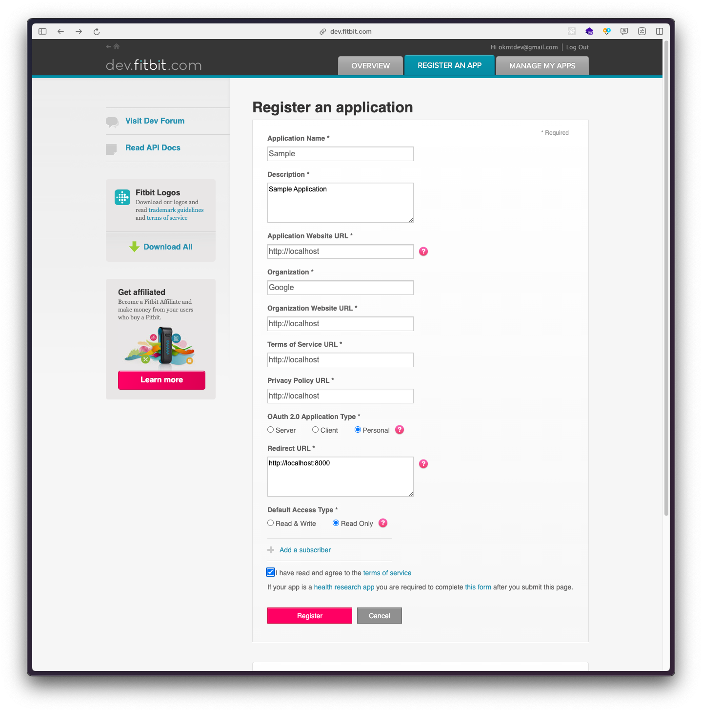
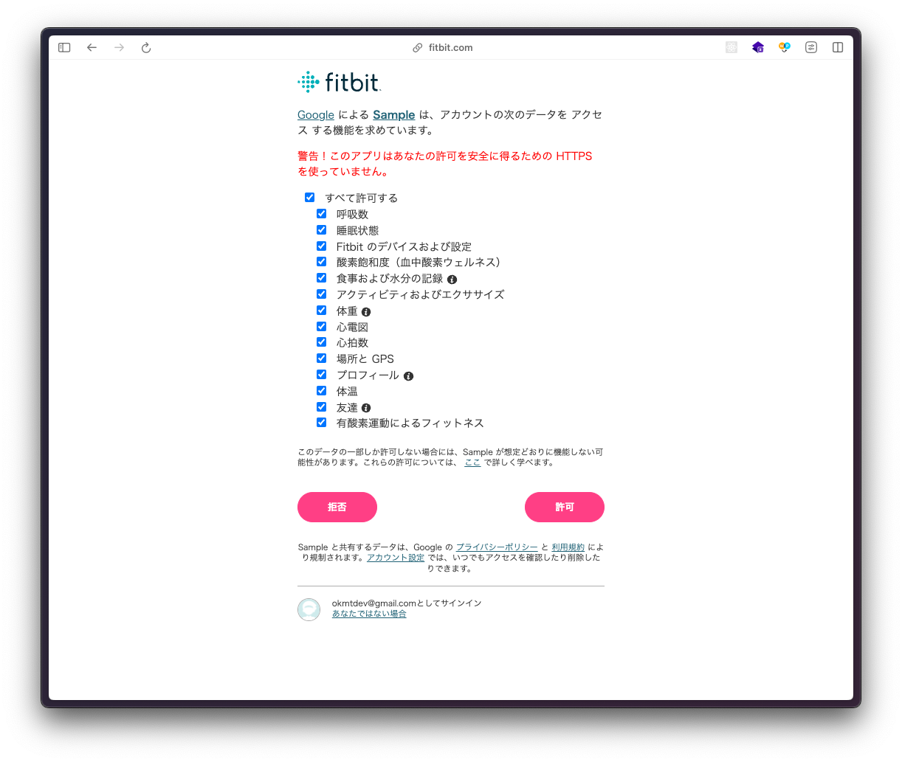
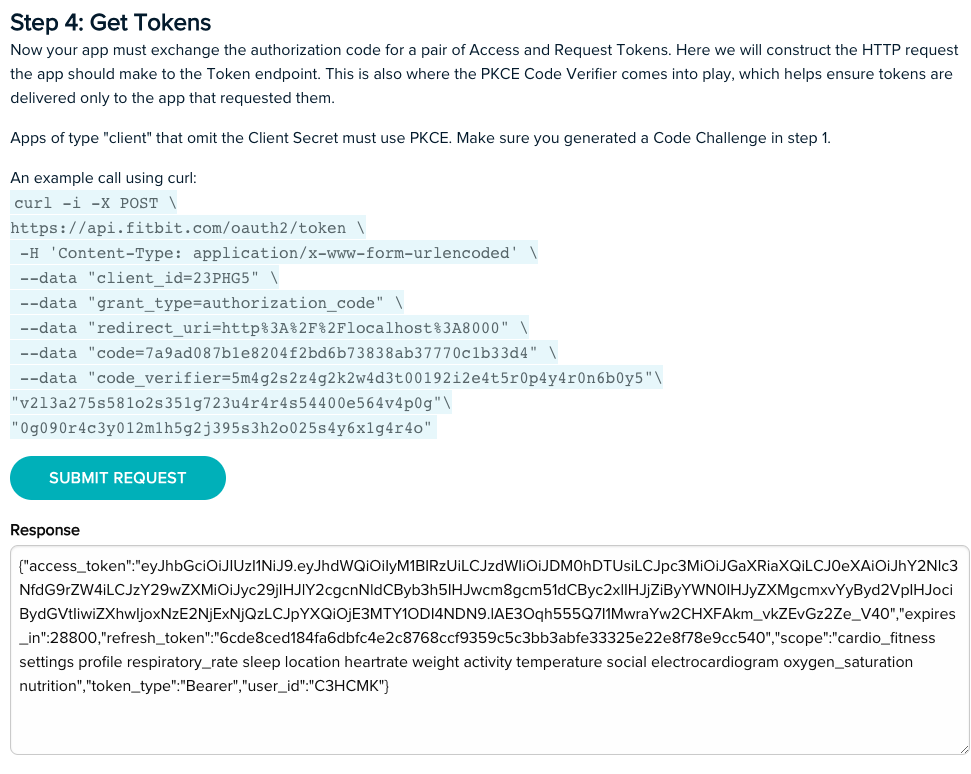

# sample-fitbit-application

[Web API Reference | fitbit developer](https://dev.fitbit.com/build/reference/web-api/)

## Auth

fitbitのアカウントを作成後、ログインして [apps - dev.fitbit.com](https://dev.fitbit.com/apps) からアプリケーションの登録を行う



- Redirect URLが重要
- OAuth 2.0 Application Type は多分「Server」でも大丈夫 -> [詳しくは](https://dev.fitbit.com/build/reference/web-api/developer-guide/application-design/)

登録後、[Fitbit OAuth 2.0 Tutorial](https://dev.fitbit.com/build/reference/web-api/troubleshooting-guide/oauth2-tutorial/) から、「Step 1: Generate PKCE and State Values」と「Step 2: Display Authorization Page」をポチポチする

Application URLをクリックすると、以下のような画面が出るので問題なければ許可する



Redirect URLで指定したURLにリダイレクトするはずなので、この時点ではブラウザ上で通信エラーの画面が出るはず。

このブラウザのURLをコピーしておいて、Fitbit OAuth 2.0 Tutorial の「Step 3: Handle the Redirect」の空欄に貼り付けます。

「Step 4: Get Tokens」では自動生成されたリクエストが得られる

`SUBMIT REQUEST`ボタンを押し、Responseにエラーがないことを確認する



その下の欄には取得したAccess Tokenが書いてあるはず。Tokenの生存期間は8時間らしい

「Step 5: Check Scopes」で `Access User Data`のリクエストを実施すると、念願のfitbitのデータが取得できる

profileを叩いた結果は以下の通り。

```
{
	"user": {
		"age": 28,
		"ambassador": false,
		"autoStrideEnabled": true,
		"avatar": "https://static0.fitbit.com/images/profile/defaultProfile_100.png",
		"avatar150": "https://static0.fitbit.com/images/profile/defaultProfile_150.png",
		"avatar640": "https://static0.fitbit.com/images/profile/defaultProfile_640.png",
		"averageDailySteps": 3273,
		"challengesBeta": true,
		"clockTimeDisplayFormat": "24hour",
		"corporate": false,
		"corporateAdmin": false,
		"dateOfBirth": "~",
		"displayName": "~",
		"displayNameSetting": "name",
		"distanceUnit": "METRIC",
		"encodedId": "C3HCMK",
		"features": {
			"exerciseGoal": true
		},
		"firstName": "~"
		"foodsLocale": "ja_JP",
		"fullName": "~"
		"gender": "MALE",
		"glucoseUnit": "METRIC",
		"height": ~,
		"heightUnit": "METRIC",
		"isBugReportEnabled": false,
		"isChild": false,
		"isCoach": false,
		"languageLocale": "ja_JP",
		"lastName": "~",
		"legalTermsAcceptRequired": false,
		"locale": "ja_JP",
		"memberSince": "2024-05-23",
		"mfaEnabled": false,
		"offsetFromUTCMillis": 32400000,
		"sdkDeveloper": false,
		"sleepTracking": "Normal",
		"startDayOfWeek": "SUNDAY",
		"strideLengthRunning": 103.30000000000001,
		"strideLengthRunningType": "auto",
		"strideLengthWalking": 69.7,
		"strideLengthWalkingType": "auto",
		"swimUnit": "METRIC",
		"temperatureUnit": "METRIC",
		"timezone": "Asia/Tokyo",
		"topBadges": [
			{
				"badgeGradientEndColor": "B0DF2A",
				"badgeGradientStartColor": "00A550",
				"badgeType": "DAILY_STEPS",
				"category": "Daily Steps",
				"cheers": [],
				"dateTime": "2024-05-23",
				"description": "5,000 steps in a day",
				"earnedMessage": "Congrats on earning your first Boat Shoe badge!",
				"encodedId": "228TQ4",
				"image100px": "https://www.gstatic.com/fitbit/badge/images/badges_new/100px/badge_daily_steps5k.png",
				"image125px": "https://www.gstatic.com/fitbit/badge/images/badges_new/125px/badge_daily_steps5k.png",
				"image300px": "https://www.gstatic.com/fitbit/badge/images/badges_new/300px/badge_daily_steps5k.png",
				"image50px": "https://www.gstatic.com/fitbit/badge/images/badges_new/badge_daily_steps5k.png",
				"image75px": "https://www.gstatic.com/fitbit/badge/images/badges_new/75px/badge_daily_steps5k.png",
				"marketingDescription": "You've walked 5,000 steps And earned the Boat Shoe badge!",
				"mobileDescription": "Congratulations on cruising your way to the first Fitbit daily step badge.",
				"name": "Boat Shoe (5,000 steps in a day)",
				"shareImage640px": "https://www.gstatic.com/fitbit/badge/images/badges_new/386px/shareLocalized/en_US/badge_daily_steps5k.png",
				"shareText": "I took 5,000 steps and earned the Boat Shoe badge! #Fitbit",
				"shortDescription": "5,000 steps",
				"shortName": "Boat Shoe",
				"timesAchieved": 1,
				"value": 5000
			}
		],
		"visibleUser": true,
		"waterUnit": "METRIC",
		"waterUnitName": "ml",
		"weight": ~,
		"weightUnit": "METRIC"
	}
}
```

- 公開したくないパーソナルデータは ~ という表記にしてます。

ここまでの操作を自動化するにはプログラムを書くしかない

## The endpoints

| Endpoint | Description |
|---|---|
| Active Zone Minutes Time Series | 1日を通してheart-pumping活動を取得する |
| ~ | ~ |
| Sleep | 睡眠パターンを取得する。「Get Sleep Log List」は過去の睡眠データが取得できる |